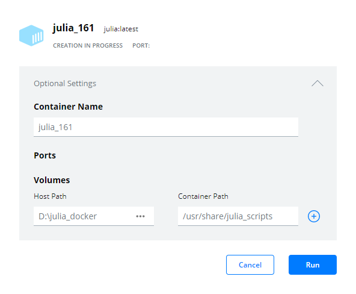
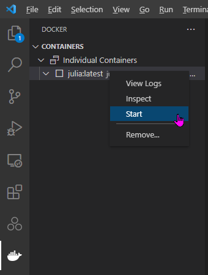
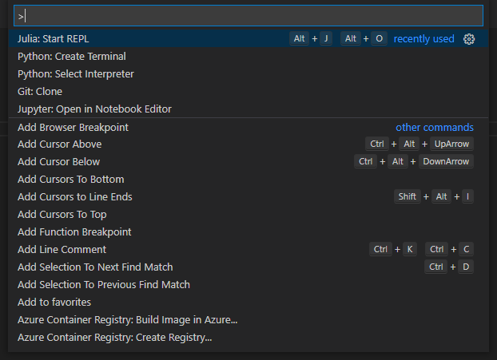
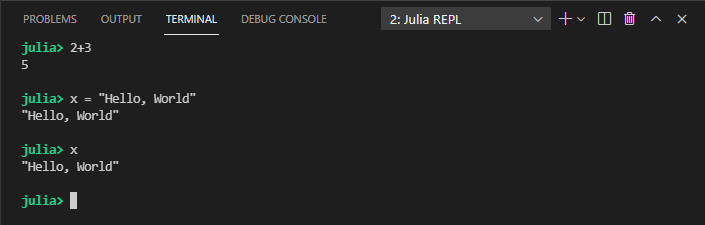
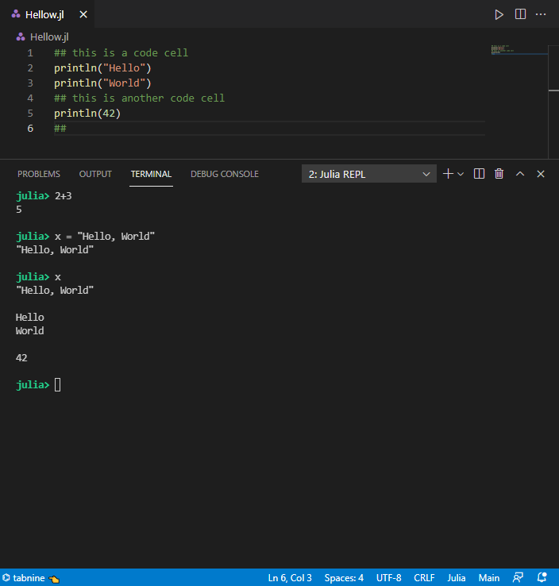
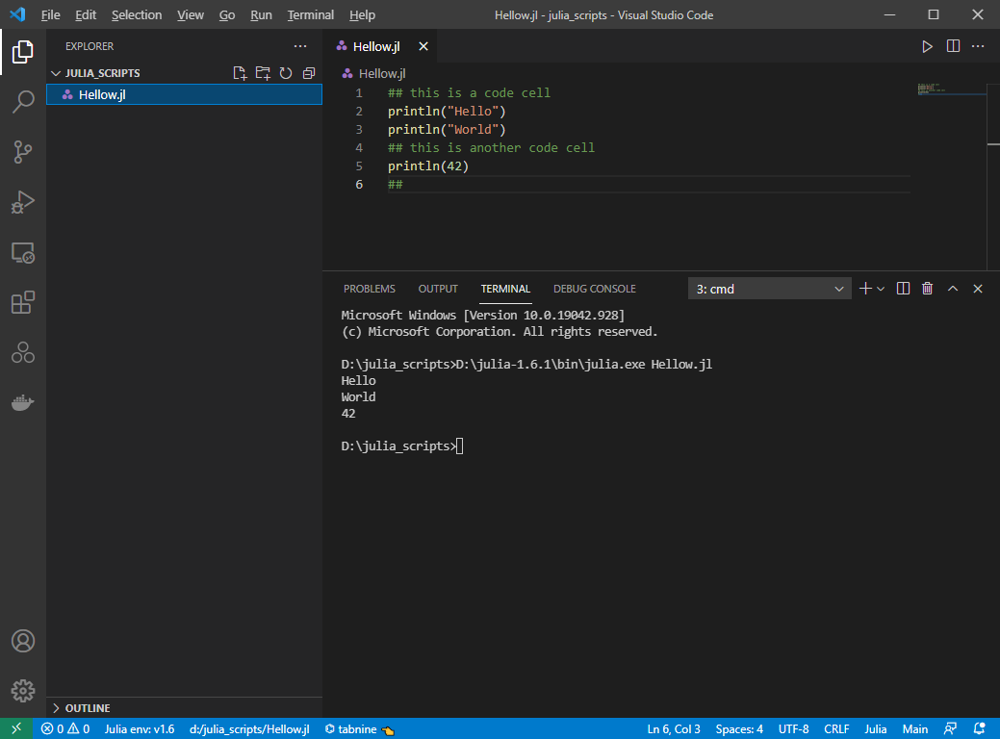
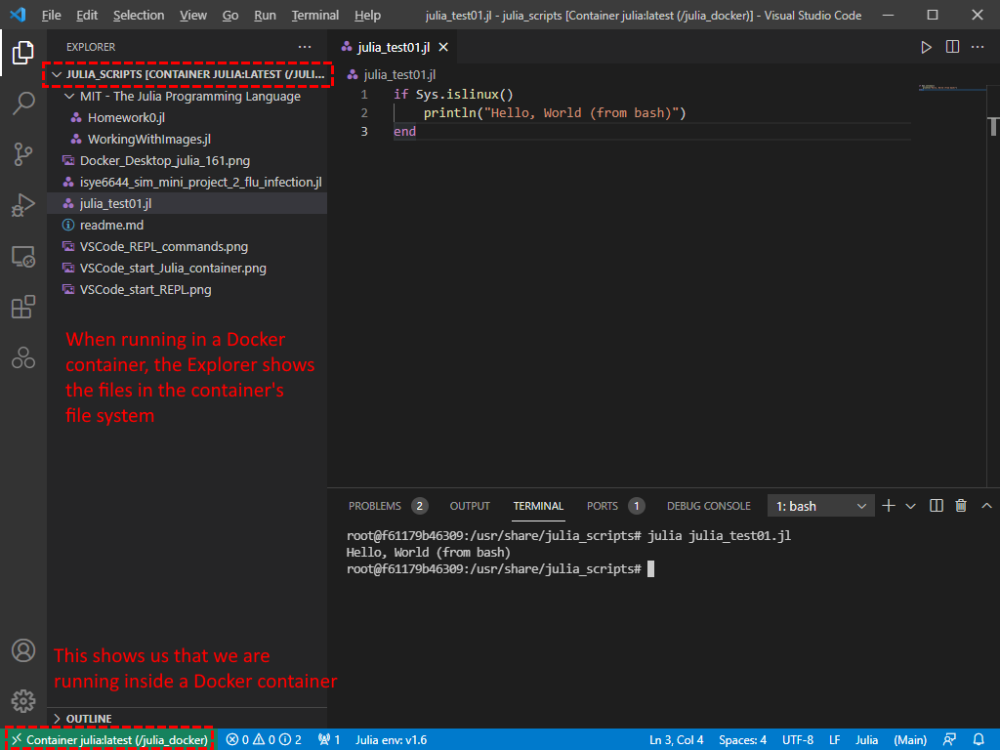

# Experimenting_with_Julia_language
 Things I learned while developing my first Julia program (a port from Python)

# Using Julia on Windows

https://www.julia-vscode.org/

## VS Code is now the default code editor for Julia

There are some resources online that still say that using **Atom Code editor** with the **Juno** extension or using **JuliaPro** (that installs Juno as the default) are the appropriate method for doing development in the Julia language. However, the position of the Julia Language group is that further feature updates to Juno will cease (while still releasing maintenance patches) and that they are going to officially support VS Code as the editor of choice for Julia development going forward.

https://techytok.com/julia-vscode/

https://devclass.com/2020/07/30/juno-julia-for-vscode-1_0/

# Install Julia

All of the steps described below assume you already have VS Code installed on your computer

## Local Installation

### Running Natively

1. Download the latest Julia language package from:  
https://julialang.org/downloads/
2. If you're wanting to experiment without doing a "formal" installation, you can download the "portable" package (which contains a fully-functional Julia installation in a zipped folder that can be used directly without doing any installation). Otherwise, choose an "installer" package.
3. With VS Code running, click on the "Extensions" side menu icon (or press _Ctrl-Shift-X_) and search for "Julia" from julialang (as of this writing, it was version 1.1.38) and allow the Julia extension to be installed.

### Running from Docker

1. If not already installed, download and install Windows Subsystem for Linux (WSL2)  
You can use the Microsoft Store app, or alternatively, visit  
https://docs.microsoft.com/en-us/windows/wsl/install-manual  
to download the installer. In either case, select the Ubuntu 20.04 distribution. This is a requirement for running Docker on Windows.
2. If not already installed, download Docker Desktop for Windows from:  
https://docs.docker.com/docker-for-windows/install/
3. Download the Julia docker image from:  
https://hub.docker.com/_/julia
4. With VS Code running, click on the "Extensions" side menu icon (or press _Ctrl-Shift-X_) and search for "Docker" from Microsoft (as of this writing, it was version 1.12.1) and allow the Docker extension to be installed.
5. You can allow a Docker container to have access to the host's file system when starting up the Docker image. This is one way to keep the files you work on inside the container available to your host PC even after you might decide to remove Docker and/or the Julia Docker image, or any containers you create with it. For example, suppose you have a folder named:  
D:\julia_docker  
where you want to store files shared between the Docker container and the host PC, you would use the following process to create your new Julia container:  
    1. In the Docker Desktop application, click on the left menu item "Images", then click on the "Run" button at the far right of the "julia" image (you need to mouse over to see the button)
    2. In the dialog box that opens, click on Optional Settings, and then add the Host Path (```D:\julia_docker```) and Container Path (```/usr/share/julia_scripts```), then click on the "Run" button. See screenshot:  
    
    3. Allegedly, you can achieve the same goal as the two steps above by executing the following line in a command prompt window after Docker and the Julia image have been successfully downloaded and installed:  
    ```docker run --name=julia_161 -d -v D:\julia_docker:/usr/share/julia_scripts julia:latest```  
    however in practice, the container created using this command failed to start.
6. After the container has been started in Docker Desktop, return to your VS Code window and confirm it is visible from the Docker extension (click on the Docker side menu icon). If necessary, you can Start the container from VS Code as well.  
  

# Editing and running Julia code in VS Code window

Julia code can be executed in the REPL (Read-Eval-Print-Loop) which is an interactive coding environment or shell. It can also be executed (stored as *.jl files) in a "compiled" state. Another option yet is to use a notebook-like environment, similar to IPython/Jupyter Notebooks.

## REPL

Julia code can be executed directly in the REPL. REPL can be started from VS Code, by launching the VS Code command selection _Ctrl-Shift-P_ and choose ```Julia: Start REPL```



Once started, the REPL "shell" will be visible in the VS Code shell area, where you can enter Julia commands for immediate execution



Besides executing code typed in the shell, REPL will also execute code in the code editor window. By placing your cursor on a line in the code and pressing _Shift-Enter_, the selected line will be executed. Furthermore, you can create "code cells" by creating comment lines on either side of a sequence of statements you want to execute in one go, and then press _Shift-Enter_ to execute the lines in the "code cell" containing the location of the selected line in the code editor. Those lines will get executed and the cursor will advance to the next "code cell".


If you press _Shift-Enter_ again, the next "code cell" will execute.



## Julia interpreter support

If running Julia installed locally, using either the installer or the portable version, you can execute an entire Julia file from the terminal window. The next example is running Julia from a portable installation (you must provide the full path to the executable unless you set the PATH variable on your own).

1. Open a Command Prompt terminal
2. At the prompt, type ```julia julia_script.jl``` to launch the Julia interpreter and have it compile and run the script named "julia_script.jl". You may need to provide a full path to either or both the julia executable and the script file.  

3. If working in a Docker container, you will need to create a new bash terminal
4. Similarly, enter the command ```julia julia_script.jl``` to have the Julia program execute inside the container.  


# Language differences between Julia and Python (or other languages)

https://docs.julialang.org/en/v1/manual/noteworthy-differences/#Noteworthy-differences-from-Python

Things I learned creating my first Julia program (porting from Python)

## Variables

1. Julia permits the use of Greek symbols as variable names. Entering the variable name typically consists of typing the LaTeX-equivalent code and hitting the Tab key immediately after, for example ```\alpha```[Tab]``` = 1.0``` which would result in the following display in the REPL:

```
α = 1
1
```

## Ternary operator

1. It is customary in Python to use syntax similar to:

```
y = 1 if x == True else 0
```
to assign a value conditionally. In Julia, there exists the proper ternary operator to achieve the same:

```
y = x == true ? 1 : 0

# Or more concisely:

y = x ? 1 : 0
```

## Strings

1. In Python, there is no distinction between characters and strings, and as  result strings (or characters) can be delimited by a single quote ```'``` or a double quote ```"```  
Julia requires that strings be delimited by double quote, and reserves single quotes for characters (a different data type from Julia's point of view).

2. In Julia, strings are concatenated using the * operator, and not the + operator as in Python

3. Python's f-string does not exist in Julia. However, the f-string may always have been a substitute for some thing that does exist in Julia, that being a proper printf (and variant sprintf) function, found in the Printf library. With an optional first argument as a file handle or file name, printf can direct output to a file, while sprintf directs output to a variable.

## Arrays

1. In Julia, array indexing starts at 1, and not at 0 as in Python

2. When slicing a Julia array, the 2nd index parameter of the slice is included in the return value

```
a = [1, 2, 3, 4]

a[2 : 4] == [2, 3, 4]

# returns true
```

2. Whereas in Python, there are numnerous numpy functions that vectorize math operations across arrays, but require the import of the library "numpy", Julia solves the vectorization issue in a different manner. In this case, the period (dot) is prefixed to the operator.

For example, this compares whether two arrays are equal:

```
b = [1, 2, 4, 8]
a == b

# returns false
```

while this compares the arrays elements wise:

```
a .== b

# returns 1, 1, 0, 0 (i.e. true, true, false, false)
```

Or...

```
a < b

# returns false
```

while...

```
a .< b

# returns 0, 0, 1, 1 (i.e. false, false, true, true)
```

If you want to assign each element in an array to a new value, you need to use the dotted assignment operator:

```
c = [1, 2, 3, 4]
c .= 2

# returns 2, 2, 2, 2
```

If you had simply done ```a = 2``` you would have replaced the vector with a scalar data type.

Some mathematical operators require the dotted version of the operators, some do not, and still others behave in different ways.

```
a = [1, 2, 3, 4]
b = [1, 2, 4, 8]

# addition and subtraction operations don't need a dot - they return identical results
a + b == a .+ b # returns true
a - b == a .- b # returns true

# The division operator can use the normal version or the dotted version but produces different results (the dotted version is a pair-wise division operation; the non-dotted version returns a matrix)
a / b == a ./ b # returns false

# Multiplication can throw an error
a .* b # returns 1, 4, 12, 32

a * b # Error
```

When applying a function to an array, the the parentheses enclosing the argument list should be preceded by a period. For example:

```
# exp(a) # Throws an error
exp.(a)

# returns 2.718281828459045, 7.38905609893065, 20.085536923187668, 54.598150033144236
```

Similarly,

```
round.(exp.(a), digits=2)

# returns 2.72, 7.39, 20.09, 54.6
```

## Functions

1. Function definitions and indeed all syntax in Julia, are governed by control structures and not by indentation. A Julia function definition is ended by an ```end``` statement, and not by outdenting the next executable line of code, as in Python. So, it's entirely possible to write a function definition on one line. For example, the following two definitions are identical (and legal):

```
function example1()
    return 1
end
```

```
function example1() return 1 end
```

2. Parameters in Julia functions can be optional or required. Julia uses the comma character between parameter names as is the convention for other languages **EXCEPT** when separating the required parameters (which must go first) from the optional parameters (which go after all the required parameter).

Some examples:

```
function example1() return 1 end

example1()

# returns 1
```

```
function example2(req1) return req1 end

example2(7)

# returns 7
```

```
function example3(req1, req2) return req1 + req2 end

example3(1, 2)

# returns 3
```

Calling a function supplying only the required parameters

```
function example4(req1, req2; opt1) return (req1 + req2) / opt1 end

example4(1, 2)

# ERROR: UndefKeywordError: keyword argument opt1 not assigned
```

Optional parameters must be named in the function calling

```
example4(1, 2, 2)

ERROR: MethodError: no method matching example4(::Int64, ::Int64, ::Int64)
```

```
example4(1, 2, opt1=2)

# returns 1.5
```

Typically, you should give optional parameters default values (or else they aren't truly optional, right?)

```
function example5(req1, req2; opt1=0) return req1 / req2 + opt1 end

example5(4, 2)

# returns 2.0
```

```
example5(4, 2, opt1=1)

# returns 3.0
```

Required parameter names must not be named in the function call

```
example5(req1=4, 2, opt1 = 1)

ERROR: MethodError: no method matching example5(::Int64; req1=4, opt1=1)
```

Functions can also be defined entirely from optional parameters

```
function example6(; opt1=1, opt2=2) return opt1 / opt2 end

example6()

# returns 0.5
```

```
example6(opt2=4)

# returns 0.25
```

Optional parameters (by definition) do not need to be stated in sequential order

```
example6(opt2=2, opt1=5)

# returns 2.5
```